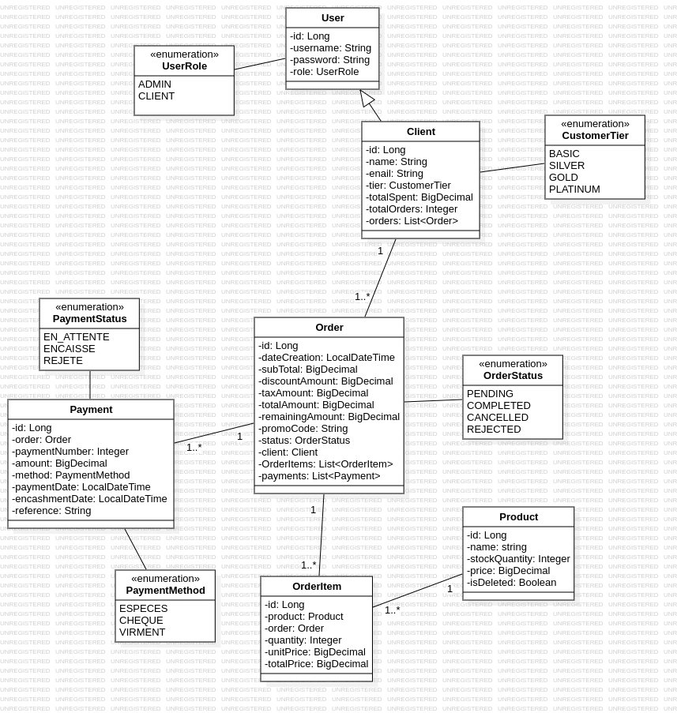

# MicroTech SmartShop



## 📋 Overview

**MicroTech SmartShop** is a B2B e-commerce backend application designed for MicroTech Maroc. It provides a comprehensive RESTful API for managing clients, products, orders, payments, and a customer loyalty program. The system features role-based access control (Admin/Client) with session-based authentication.

### Key Features

- **Client Management**: CRUD operations for B2B clients with tiered loyalty system (BASIC, SILVER, GOLD, PLATINUM)
- **Product Catalog**: Product inventory management with soft-delete capabilities
- **Order Processing**: Complete order lifecycle management (PENDING → CONFIRMED/CANCELED)
- **Payment Tracking**: Multi-payment support per order with various payment methods
- **Customer Loyalty**: Automatic tier upgrades based on spending thresholds
- **Session Authentication**: Secure session-based auth with role-based access control
- **Data Validation**: Jakarta Bean Validation throughout DTOs
- **Exception Handling**: Centralized error handling with custom business exceptions

---

## 🏗️ Architecture

### Technology Stack

- **Framework**: Spring Boot 3.2.5
- **Language**: Java 17
- **Database**: PostgreSQL
- **ORM**: Spring Data JPA (Hibernate)
- **API Documentation**: SpringDoc OpenAPI 2.5.0
- **Validation**: Jakarta Validation
- **Security**: BCrypt password hashing
- **Build Tool**: Maven

### Project Structure

```
src/main/java/com/SmartShop/MicroTech_SmartShop/
├── config/              # Configuration classes
│   ├── AuthInterceptor.java      # Session-based auth interceptor
│   ├── DataInitializer.java      # Seed data for testing
│   └── WebConfig.java             # Web MVC configuration
├── controller/          # REST API endpoints
│   ├── AuthController.java       # Login/Logout
│   ├── ClientController.java     # Client management
│   ├── OrderController.java      # Order operations
│   ├── PaymentController.java    # Payment processing
│   └── ProductController.java    # Product catalog
├── dto/
│   ├── request/        # Request DTOs with validation
│   └── response/       # Response DTOs
├── entity/             # JPA entities
│   ├── Client.java               # B2B customer entity
│   ├── Order.java                # Purchase order
│   ├── OrderItem.java            # Order line items
│   ├── Payment.java              # Payment records
│   ├── Product.java              # Product catalog
│   └── User.java                 # Authentication user
├── enums/              # Business domain enums
│   ├── CustomerTier.java         # BASIC/SILVER/GOLD/PLATINUM
│   ├── OrderStatus.java          # Order lifecycle states
│   ├── PaymentMethod.java        # Payment types
│   ├── PaymentStatus.java        # Payment states
│   └── UserRole.java             # ADMIN/CLIENT roles
├── exception/          # Error handling
│   ├── BusinessException.java
│   ├── ResourceNotFoundException.java
│   ├── ErrorResponse.java
│   └── GlobalExceptionHandler.java
├── mapper/             # MapStruct DTO-Entity converters
├── repository/         # Spring Data JPA repositories
├── service/            # Business logic layer
│   ├── LoyaltyService.java       # Tier calculation logic
│   └── ...                       # Other services
└── utils/              # Utility classes
    └── PasswordUtil.java         # BCrypt password hashing
```

---

## 🗄️ Domain Model

### Core Entities

#### User
- Authentication entity with username/password
- Role: ADMIN or CLIENT
- One-to-One relationship with Client

#### Client
- B2B customer profile
- Tracks totalSpent and totalOrders for loyalty tier calculation
- CustomerTier: BASIC (default), SILVER (≥ 5000 MAD), GOLD (≥ 15000 MAD), PLATINUM (≥ 50000 MAD)

#### Product
- Product catalog with name, unitPrice, stockQuantity
- Soft-delete functionality (isDeleted flag)

#### Order
- Purchase order with line items (OrderItem)
- Financial calculations: subTotal (HT), discountAmount, taxAmount, totalAmount (TTC), remainingAmount
- Status: PENDING, CONFIRMED, CANCELED, REJECTED
- Optional promo code support

#### Payment
- Payment records linked to orders
- Multiple payments per order (partial payments)
- Payment method tracking (CREDIT_CARD, CASH, BANK_TRANSFER, etc.)
- Status: PENDING, CONFIRMED, REJECTED

---

## 🔌 API Endpoints

Base URL: `http://localhost:8080`

### Authentication
| Method | Endpoint | Description | Access |
|--------|----------|-------------|--------|
| POST | `/api/auth/login` | Login with username/password | Public |
| POST | `/api/auth/logout` | Logout current session | Authenticated |

### Clients
| Method | Endpoint | Description | Access |
|--------|----------|-------------|--------|
| POST | `/api/clients` | Create new client | Admin |
| GET | `/api/clients` | List all clients | Admin |
| GET | `/api/clients/{id}` | Get client by ID | Admin |
| PUT | `/api/clients/{id}` | Update client | Admin |
| GET | `/api/clients/profile` | Get authenticated client profile | Client |

### Products
| Method | Endpoint | Description | Access |
|--------|----------|-------------|--------|
| POST | `/api/products` | Create product | Admin |
| GET | `/api/products` | List all products (paginated) | Authenticated |
| GET | `/api/products/{id}` | Get product by ID | Authenticated |
| PUT | `/api/products/{id}` | Update product | Admin |
| DELETE | `/api/products/{id}` | Soft-delete product | Admin |

### Orders
| Method | Endpoint | Description | Access |
|--------|----------|-------------|--------|
| POST | `/api/orders` | Create order | Admin |
| GET | `/api/orders/{id}` | Get order details | Admin / Order owner |
| PUT | `/api/orders/{id}/confirm` | Confirm order | Admin |
| PUT | `/api/orders/{id}/cancel` | Cancel order | Admin |
| GET | `/api/orders/history` | Get client order history | Client |

### Payments
| Method | Endpoint | Description | Access |
|--------|----------|-------------|--------|
| POST | `/api/payments` | Record payment | Admin |
| GET | `/api/payments/order/{orderId}` | Get payments for order | Authenticated |
| PUT | `/api/payments/confirm/{paymentId}` | Confirm payment | Admin |
| PUT | `/api/payments/reject/{paymentId}` | Reject payment | Admin |

---

## 🚀 Getting Started

### Prerequisites

- Java 17 or higher
- Maven 3.6+
- PostgreSQL 12+

### Database Setup

1. Create a PostgreSQL database:
```sql
CREATE DATABASE smartshop_db;
```

2. Update database credentials in `src/main/resources/application.properties`:
```properties
spring.datasource.url=jdbc:postgresql://localhost:5432/smartshop_db
spring.datasource.username=postgres
spring.datasource.password=your_password
```

### Build and Run

1. **Clone the repository**:
```bash
git clone https://github.com/saadelquaul/MicroTech-SmartShop.git
cd MicroTech-SmartShop
```

2. **Build the project**:
```bash
./mvnw clean install
```

3. **Run the application**:
```bash
./mvnw spring-boot:run
```


4. **Access the application**:
- API Base: `http://localhost:8080`
- Swagger UI: `http://localhost:8080/swagger-ui.html`

### Running Tests

```bash
./mvnw test
```

---

## 🧪 Sample Data

The application includes a `DataInitializer` that seeds test data on startup:

- **Admin User**: `admin` / `admin123`
- **Client Users**: Pre-configured test clients with various loyalty tiers
- **Products**: Sample product catalog

---

## 🔐 Authentication

The application uses **session-based authentication**:

1. **Login**: POST `/api/auth/login` with credentials
2. **Session Cookie**: Server returns `JSESSIONID` cookie
3. **Subsequent Requests**: Include session cookie in headers
4. **Authorization**: Routes protected by role (ADMIN/CLIENT)

Example login request:
```json
POST /api/auth/login
{
  "username": "admin",
  "password": "admin123"
}
```

---

## 📊 Loyalty System

The `LoyaltyService` automatically calculates customer tiers based on `totalSpent`:

| Tier | Threshold |
|------|-----------|
| BASIC | < 5,000 MAD |
| SILVER | ≥ 5,000 MAD |
| GOLD | ≥ 15,000 MAD |
| PLATINUM | ≥ 50,000 MAD |

Tier upgrades occur automatically when orders are confirmed.

---

## 🛠️ Development

### Key Dependencies

```xml
<!-- Spring Boot Starters -->
spring-boot-starter-web
spring-boot-starter-data-jpa
spring-boot-starter-validation

<!-- Database -->
postgresql

<!-- Utilities -->
lombok (1.18.30)
jbcrypt (0.4)

<!-- API Documentation -->
springdoc-openapi-starter-webmvc-ui (2.5.0)
```


## 👤 Author

**saadelquaul**  
Repository: [MicroTech-SmartShop](https://github.com/saadelquaul/MicroTech-SmartShop)

---

